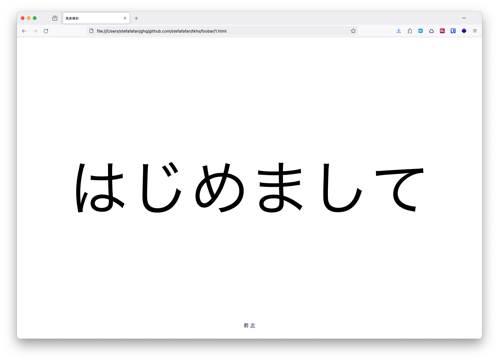
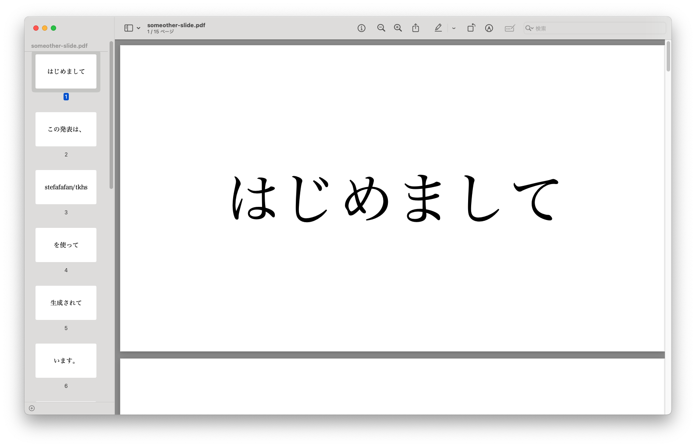

# tkhs

tkhs is a simple CLI program that helps generate presentation material in a Takashi-method style.

See here for an explanation of Takahashi-method (Japanese): http://www.rubycolor.org/takahashi/

## Usage
### Preparation
After cloning this repository, install dependencies with `composer`
```sh
$ git clone https://github.com/stefafafan/tkhs.git
$ cd tkhs
$ composer install
```

Prepare presentation material, so that 1 line is equivalent to 1 slide. Check out `sample.txt`.
```sh
$ cat sample.txt
はじめまして
この発表は、
stefafafan/tkhs
を使って
生成されて
います。
1スライドにつき
数文字ずつ
発表する
このスタイル
は
高橋メソッド
として
知られています
完
```

### Generate an HTML slide.
Use `generate:html` to generate a series of HTML files. By default the output directory is `output/`. Make sure you have `php` installed.

```sh
$ php ./bin/tkhs generate:html sample.txt
Exported: output/1.html
Exported: output/2.html
Exported: output/3.html
Exported: output/4.html
Exported: output/5.html
Exported: output/6.html
Exported: output/7.html
Exported: output/8.html
Exported: output/9.html
Exported: output/10.html
Exported: output/11.html
Exported: output/12.html
Exported: output/13.html
Exported: output/14.html
Exported: output/15.html
```

You can specify the output directory by giving the directory name.
```sh
$ php ./bin/tkhs generate:html sample.txt foobar
Exported: foobar/1.html
Exported: foobar/2.html
Exported: foobar/3.html
Exported: foobar/4.html
Exported: foobar/5.html
Exported: foobar/6.html
Exported: foobar/7.html
Exported: foobar/8.html
Exported: foobar/9.html
Exported: foobar/10.html
Exported: foobar/11.html
Exported: foobar/12.html
Exported: foobar/13.html
Exported: foobar/14.html
Exported: foobar/15.html
```

Open `1.html` and you will have the first slide presented. Links to the next and previous slides are shown at the bottom of the screen (as `前` and `次`).



### Generate a PDF slide.
Similarly, you can use `generate:pdf` to compile the slide to a single PDF file. This is especially useful when you want to just have a single file, or upload the slide to any slide sharing service.

```sh
$ php ./bin/tkhs generate:pdf sample.txt
PDF generated: slide.pdf
```

By default the slide will be exported to `slide.pdf`, but you can specify a different filename as well.

```sh
$ php ./bin/tkhs generate:pdf sample.txt someother-slide.pdf
PDF generated: someother-slide.pdf
```

Open the pdf file and now you can start presenting! :sparkles:


